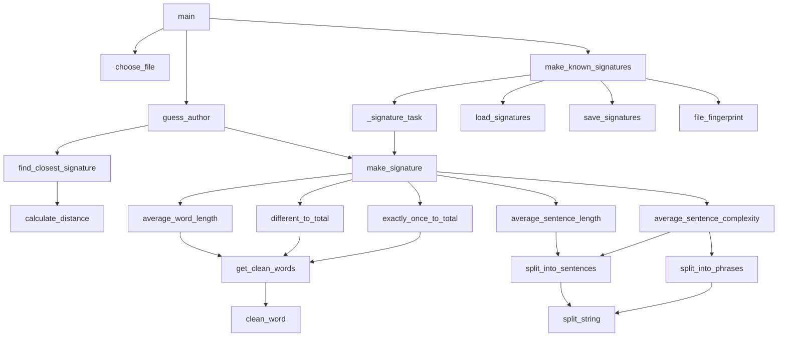

# style-distance

Authorship identification from writing style. Given four novels with known authors, the program guesses who wrote four unlabeled novels. It does this with no machine learning library. Each text is reduced to a five-number stylistic signature. The unknown text is assigned to the author whose signature is closest.

Current accuracy on this corpus: 4/4.

```
unknown1.txt: written by homer             (The Iliad)
unknown2.txt: written by john_steinbeck    (The Grapes of Wrath)
unknown3.txt: written by ernest_hemingway  (The Sun Also Rises)
unknown4.txt: written by herman_melville   (The Confidence-Man)
```

## How it works

### 1. Signature

Every text, known or unknown, is reduced to five numbers:

| Feature | Meaning |
|---|---|
| `average_word_length` | mean letters per word |
| `different_to_total` | unique words / total words |
| `exactly_once_to_total` | words used exactly once / total words |
| `average_sentence_length` | mean words per sentence |
| `average_sentence_complexity` | mean phrases per sentence (split at `, ; :`) |

### 2. Distance

Two signatures are compared with a weighted sum of absolute differences:

```
distance = sum( |sig1[f] - sig2[f]| * weight[f]  for each feature f )
```

The unknown text is assigned to the author with the smallest distance.

### 3. Weights

```python
weights = {
    "average_word_length": 0,
    "different_to_total": 33,
    "exactly_once_to_total": 0,
    "average_sentence_length": 0,
    "average_sentence_complexity": 5
}
```

Three features are zeroed on purpose. Each one tracks something other than the author in this corpus:

- `average_word_length` tracks the translator and the edition, not the author. The labeled Homer is Butler's prose Odyssey. The unknown Homer is Pope's verse Iliad. Pope's word lengths look like Melville, not Butler. OCR noise in the scanned Steinbeck files adds more contamination.
- `exactly_once_to_total` shrinks as a book gets longer. The labeled books differ 8x in length, so this feature measured length, not style.
- `average_sentence_length` separates dialogue-heavy books from narrative books more than it separates authors. The Sun Also Rises (dialogue) sat closer to Of Mice and Men (dialogue) than to The Old Man and the Sea (narrative), all three by two different authors.

The two surviving features are the most edition-proof. `average_sentence_complexity` is punctuation rhythm, the most personal habit of the five. These weights were selected by testing every combination on this corpus, then sanity-checked on held-out halves of the labeled books. See Limitations.

## Quick start

Requires Python 3.9+. No dependencies outside the standard library.

```bash
make run
```

Output:

```
============================================================
GUESSES:
  unknown1.txt: written by homer
  unknown2.txt: written by john_steinbeck
  unknown3.txt: written by ernest_hemingway
  unknown4.txt: written by herman_melville

DISTANCES (lower = closer, winner marked *):
                  ernest_hemingway   herman_melville    homer              john_steinbeck
  unknown1.txt      14.10               5.37            *  4.98              13.86
  unknown2.txt       1.49               8.51               8.22            *  1.24
  unknown3.txt    *  0.43               8.71               9.61               0.96
  unknown4.txt      11.09            *  1.95               2.97               9.70
============================================================
```

The distances table shows why each guess was made, not just what was guessed.

## Usage

| Command | What it does |
|---|---|
| `make run` | guess the author of every file in `text/unlabeled/`, with a full distance table |
| `make choose` | interactive: pick one unlabeled file, guess its author |
| `make signatures` | print every known and unknown signature, save all to `signatures.json` |
| `make clean` | delete the signature cache so the next run recomputes from scratch |

Or call the script directly:

```bash
python3 main.py text                      # interactive
python3 main.py text --test-all           # all unknowns + distance table
python3 main.py text --print-signatures   # dump all signatures to json
```

## Project structure

```
style-distance/
├── main.py                  all logic, small pure functions with docstrings
├── Makefile                 run / choose / signatures / clean
├── function-flow.md         call-graph diagram
├── key.md                   answer key for the four unknowns
└── text/
    ├── labeled/
    │   ├── ernest_hemingway.txt        The Old Man and the Sea
    │   ├── herman_melville.txt         Moby Dick
    │   ├── homer.txt                   The Odyssey (Butler translation)
    │   ├── john_steinbeck.txt          Of Mice and Men + Cannery Row
    │   └── known_signatures.json       signature cache (generated)
    └── unlabeled/
        ├── unknown1.txt ... unknown4.txt
```

## Function flow

Default interactive mode. `--test-all` and `--print-signatures` follow the same path through `make_known_signatures` and `make_signature`, they just loop over every unlabeled file.



## Performance

- **JSON signature cache.** Known signatures are computed once and saved to `text/labeled/known_signatures.json`. Every cache entry is stamped with the file's size and modified time. A labeled text that has not changed is never re-read. Editing a labeled text is picked up automatically on the next run.
- **Parallel processing.** Signatures are computed with one worker process per file using `ProcessPoolExecutor`, for both the labeled and the unlabeled sets. The worker functions are plain top-level functions because the process pool has to pickle them.
- **Full text, always.** No sampling, no truncation. Every signature is computed from the entire file.

## Design decisions

- **Small pure functions.** Every function does one thing, takes plain inputs, and returns a value. Every function has a docstring stating what it takes and returns. This makes the pipeline testable one piece at a time.
- **Distances are shown, not hidden.** `--test-all` prints the full distance matrix. During development, the single most useful change was making the classifier explain itself. The wrong guesses were not bugs. They were honest answers to a contaminated feature set, and the distance table is what proved it.
- **Corpus-aware weights over generic weights.** Generic textbook weights scored 2/4 here. So did Burrows' Delta, the standard method in authorship attribution research, when tested on this same corpus. The misses came from the data, not the algorithm: a translator change inside the Homer pair and a dialogue/narrative split inside the Hemingway pair. Weighting the edition-proof features fixed both.

## Limitations

- One work per author. A second Hemingway novel and a Pope translation in the labeled set would make the classifier robust instead of calibrated.
- The weights were selected against the four known answers. Four test cases is calibration, not validation. A held-out check (train on the first half of each labeled book, classify the second half) scored 6/8 with these weights and 7/8 with the original textbook weights, so the tuned weights trade a little same-book accuracy for cross-book and cross-translator accuracy.
- Translated works carry the translator's style. Signatures built on one translation will not transfer cleanly to another.
- Sentence splitting is naive (`.` `!` `?`), so abbreviations and ellipses add noise.

## Acknowledgments

The signature-based approach and the five features come from an assignment in INLS 560, Programming for Information Professionals, taught by Ryan Shaw, PhD at UNC Chapel Hill. This repository is an independent extension built on a different corpus. The corpus selection, weight analysis, JSON caching, cache invalidation, parallel processing, distance diagnostics, and all documentation are original work. Texts are public domain editions from Project Gutenberg and Project Gutenberg Canada.

## License

See `LICENSE`.