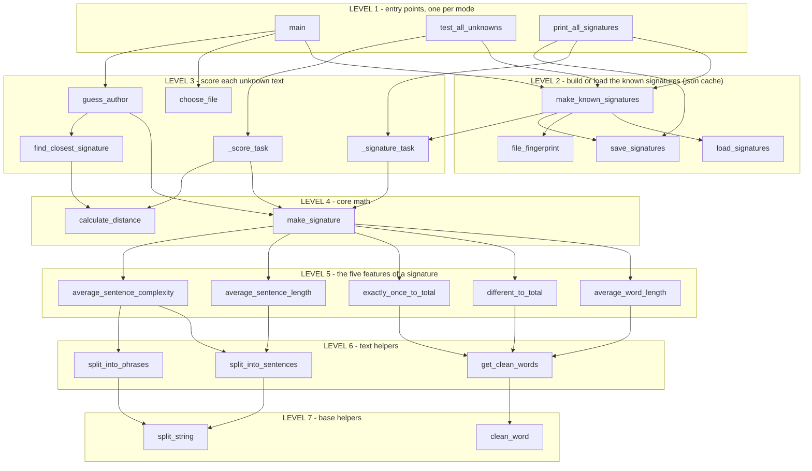

# Function flow / FINAL

```mermaid
flowchart TD
    %% ---------- LEVEL 1: the three modes ----------
    subgraph L1 ["LEVEL 1 - entry points, one per mode"]
        direction LR
        main
        test_all_unknowns
        print_all_signatures
    end

    %% ---------- LEVEL 2: known signatures + json cache ----------
    subgraph L2 ["LEVEL 2 - build or load the known signatures (json cache)"]
        direction LR
        make_known_signatures
        load_signatures
        file_fingerprint
        save_signatures
    end

    %% ---------- LEVEL 3: score the unknown texts ----------
    subgraph L3 ["LEVEL 3 - score each unknown text"]
        direction LR
        choose_file
        guess_author
        _score_task
        _signature_task
        find_closest_signature
    end

    %% ---------- LEVEL 4: the core math ----------
    subgraph L4 ["LEVEL 4 - core math"]
        direction LR
        make_signature
        calculate_distance
    end

    %% ---------- LEVEL 5: the five signature features ----------
    subgraph L5 ["LEVEL 5 - the five features of a signature"]
        direction LR
        average_word_length
        different_to_total
        exactly_once_to_total
        average_sentence_length
        average_sentence_complexity
    end

    %% ---------- LEVEL 6: text splitting helpers ----------
    subgraph L6 ["LEVEL 6 - text helpers"]
        direction LR
        get_clean_words
        split_into_sentences
        split_into_phrases
    end

    %% ---------- LEVEL 7: base helpers ----------
    subgraph L7 ["LEVEL 7 - base helpers"]
        direction LR
        clean_word
        split_string
    end

    %% ---------- calls: level 1 down ----------
    main --> make_known_signatures
    main --> choose_file
    main --> guess_author

    test_all_unknowns --> make_known_signatures
    test_all_unknowns --> _score_task

    print_all_signatures --> make_known_signatures
    print_all_signatures --> _signature_task
    print_all_signatures --> save_signatures

    %% ---------- calls: level 2 down ----------
    make_known_signatures --> load_signatures
    make_known_signatures --> file_fingerprint
    make_known_signatures --> save_signatures
    make_known_signatures --> _signature_task

    %% ---------- calls: level 3 down ----------
    guess_author --> make_signature
    guess_author --> find_closest_signature
    _score_task --> make_signature
    _score_task --> calculate_distance
    _signature_task --> make_signature
    find_closest_signature --> calculate_distance

    %% ---------- calls: level 4 down ----------
    make_signature --> average_word_length
    make_signature --> different_to_total
    make_signature --> exactly_once_to_total
    make_signature --> average_sentence_length
    make_signature --> average_sentence_complexity

    %% ---------- calls: level 5 down ----------
    average_word_length --> get_clean_words
    different_to_total --> get_clean_words
    exactly_once_to_total --> get_clean_words
    average_sentence_length --> split_into_sentences
    average_sentence_complexity --> split_into_sentences
    average_sentence_complexity --> split_into_phrases

    %% ---------- calls: level 6 down ----------
    get_clean_words --> clean_word
    split_into_sentences --> split_string
    split_into_phrases --> split_string
```