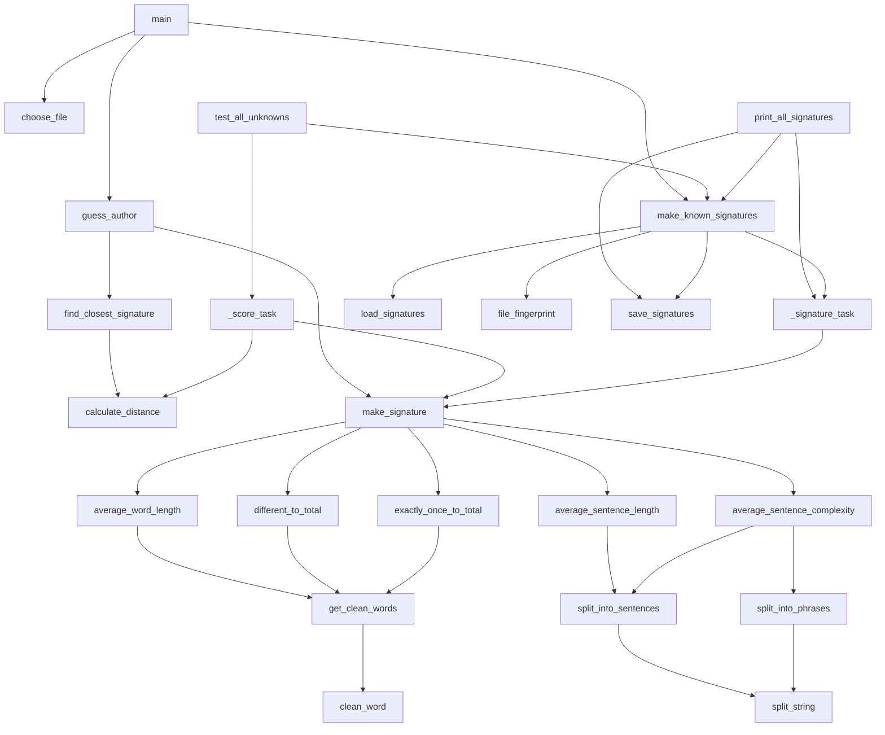

# Function flow / FINAL

```mermaid
%%{init: {"flowchart": {"rankSpacing": 120, "nodeSpacing": 70, "curve": "basis"}} }%%
flowchart TD
    %% Functions
    main

    choose_file
    guess_author
    test_all_unknowns
    print_all_signatures

    find_closest_signature
    _score_task
    make_known_signatures

    calculate_distance
    _signature_task
    load_signatures
    file_fingerprint
    save_signatures

    make_signature

    average_word_length
    different_to_total
    exactly_once_to_total
    average_sentence_length
    average_sentence_complexity

    get_clean_words
    split_into_sentences
    split_into_phrases
    clean_word
    split_string

    %% invisible links: keep main alone and centered on the top level
    main ~~~ test_all_unknowns
    main ~~~ print_all_signatures

    %% Calls
    main --> choose_file
    main --> guess_author
    main --> make_known_signatures

    guess_author --> find_closest_signature
    guess_author --> make_signature

    test_all_unknowns --> _score_task
    test_all_unknowns --> make_known_signatures

    print_all_signatures --> make_known_signatures
    print_all_signatures --> _signature_task
    print_all_signatures --> save_signatures

    find_closest_signature --> calculate_distance
    _score_task --> make_signature
    _score_task --> calculate_distance

    make_known_signatures --> _signature_task
    make_known_signatures --> load_signatures
    make_known_signatures --> file_fingerprint
    make_known_signatures --> save_signatures

    _signature_task --> make_signature

    make_signature --> average_word_length
    make_signature --> different_to_total
    make_signature --> exactly_once_to_total
    make_signature --> average_sentence_length
    make_signature --> average_sentence_complexity

    average_word_length --> get_clean_words
    different_to_total --> get_clean_words
    exactly_once_to_total --> get_clean_words
    get_clean_words --> clean_word

    average_sentence_length --> split_into_sentences
    average_sentence_complexity --> split_into_sentences
    average_sentence_complexity --> split_into_phrases

    split_into_sentences --> split_string
    split_into_phrases --> split_string
```